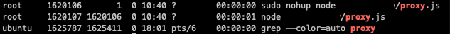

# Pm2를 사용해 React와 Nest 배포하기

>현재 맡게된 프로젝트에서 클라이언트와 서버를 배포할일이 생겨서 배포방법을 찾아보다가 PM2를 사용한 배포를 하기로 결정했다.

## **Pm2 란?**
Pm2 는 Node.js의 데몬 프로세스 매니저다. Node.js를 클러스터 모드로 돌리거나 (Node.js는 싱글 스레드이여서 멀티코어처럼 돌리고 싶어서) 무중단 배포를 할때 사용한다.

## 현재 내 배포 서버 상황
* AWS ec2를 사용해 배포를 해야한다.   
* 현재 존재하는 인스턴스는 1개고 그 위에서 6개의 다른 프로그램이 각 포트별로 돌아가고 있다.
(이 6개의 프로그램은 다른분들이 하신거라 무슨 프로그램인지 모르고 건들일 수 없다.)
* 또한 포트는 80번 하나만 열고 프록시를 통해 **경로 기반**으로 요청을 알맞은 프로그램으로 분배하고 있다. 즉, 도메인 뒤에 붙는 Path에 따라 어느 포트로 갈지 내가 구현해야 한다는 사실. (프록시 서버는 express로 짜여져 nohup로 배포되어 있었다.)
* **AWS 변경&조회 권한은 나에게 없다.**

>이미 어느정도 진행된 프로젝트에 투입 된거라서 짜여진 틀에 맞추어 진행해야했다...🥺 

- - -

<br/>
모든 작업은 pem 파일을 받아서 SSH로 접속해서 진행했다.
##### 🤞pem 파일은 꼭 umask를 0600으로 바꿔주기!   

<br/>

## **Proxy 서버 변경하고 nohup로 재배포 하기**
클라이언트와 서버 배포 이전에 요청을 받을 proxy 서버를 먼저 바꿔주었다. proxy 서버는 express에서 `http-proxy` 라이브러리를 통해 짜여져있었다.   
<br/>
__proxy.js__
```
const httpProxy = require('http-proxy');
const apiProxy = httpProxy.createProxyServer();

... // backend1~backend6 다른 프로그램
const backend7 = 'http://localhost:12345', //server
backend8 = 'http://localhost:3000'; // client

app.all("/api", function (req, res) {
  try {
    apiProxy.web(req, res, { target: backend7 }, (e) => {
      console.log(e)
    });
  } catch (e) {
    console.log(e)
  }
});

app.all("/api/*", function (req, res) {
  try {
    apiProxy.web(req, res, { target: backend7 }, (e) => {
      console.log(e)
    });
  } catch (e) {
    console.log(e)
  }
});

app.all("/client", function (req, res) {
  try {
    apiProxy.web(req, res, { target: backend8 }, (e) => {
      console.log(e)
    });
  } catch (e) { 
    console.log(e);
  }
});

app.all("/client/*", function (req, res) {
  try {
    apiProxy.web(req, res, { target: backend8 }, (e) => {
      console.log(e)
    });
  } catch (e) {
    console.log(e);
  }
});

...
const server = http.createServer(app);
server.listen(80);
```
클라이언트 프로그램은 리액트 기본포트인 3000에 띄우고 (backend7) `/client`, `/client/*` path로 들어오는 모든 요청을 해당 URI로 매핑해 줬다.   
서버 프로그램은 내가 지정한 포트 12345에 띄우고 (backend8) `/api` ,`/api/*` path로 들어오는 모든 요청을 해당 URI로 매핑해 줬다.
변수명이나 프록시서버를 짜는 형태는 이미 다 정해져있었기에 나는 해당 format대로 코드만 추가 할 수 밖에 없었다... ~~(변명입니다)~~
<br/>
<br/>
배포는 nohup로 되어있어서 그대로 nohup로 재배포 했다.   
우선 nohup가 어떤식으로 돌아가고 있는지 보기 위해 서버 프로세스를 확인했다.   
__proxy 관련 서버 프로세스 확인__
```
ps -ef | grep proxy
```
프록시 서버 실행파일 이름이 proxy.js 라서 저걸로 grep 했다.   
    

일단 프록시 서버를 먼저 내렸다.   
__프로세스 끄기__
```
sudo kill [프로세스 id]
```
__nohup으로 프로그램 실행__
```
sudo nohup node [프로그램 실행 파일 이름]
```
root 권한으로 실행시켜야 하기에 sudo를 붙였다.   
`ps -ef | grep proxy` 로 다시 살펴보니 잘 실행된걸 확인했다!
<br/>
- - -
<br/>

## **Nest.js 프로그램 무중단 배포하기**
Pm2는 이미 깔려있어서 바로 배포 진행했다.   
우선 Nest로 짜여진 서버부터 배포했다.    
<br/>
__ecosystem.config.js 파일 생성__
```
pm2 ecosystem
```
위 키워드를 사용해 설정 파일을 생성해 관리할 수도 있지만 나는 그렇게 까지 할 필요를 못느껴서 그냥 사용했다.   
배포를 하는 방법은 2가지가 있는데   
 1. build 파일을 배포하거나
 2. 프로그램 실행 파일을 바로 실행시키는 것이다.

 나는 서버는 내가 짠 것이라 그냥 2번으로 배포했다.

__프로그램 실행__
```
pm2 start [프로그램 실행 파일 이름]
```
이때 실행파일이 name 으로 설정된다. 바꾸고 싶다면   
```
pm2 start [프로그램 실행 파일 이름] --name [이름]   
```
이미 pm2 를 이용해 배포 된 프로그램을 수정해서 다시 배포하려면   
__재실행__
```
pm2 restart [프로그램 실행 파일 이름]
```
__삭제__
```
pm2 delete [프로세스 id]
```
__배포 된 프로그램들 보기__
```
pm2 list
```
짜잔... 성공~   
이때까지만 해도 <배포 [~희망편~]>
<br/>
   

- - -
<br/>

## **React.js 프로그램 무중단 배포하기**

클라이언트 부분은 내가 짠게 아니고 같이 하시는 리액트 개발자님이 짜신거라서 빌드파일을 달라고해서 배포하는 방식으로 진행했다.   
~~git clone 해서 실행시키면 되지만 달라하는게 편해서..~~  
이때는 serve 라이브러리도 같이 깔아서 사용했다.   
<br/>
__이름까지 지정해서 빌드폴더 올리기__

```
pm2 serve [빌드폴더 경로] [포트번호] --spa --name [이름]
```
spa 옵션은 React의 작동 방식인 single page application 약자이다.
이렇게 배포하면 아까와 같이 잘 배포 되어야 한다..   
근데 pm2 상으로는 제대로 배포가 잘되었는데 해당 URI로 들어가면 (http://localhost:80/client) 흰화면만 뜬다..
이때부터 무한 디버깅이 시작된다... <배포 [~절망편~]>...